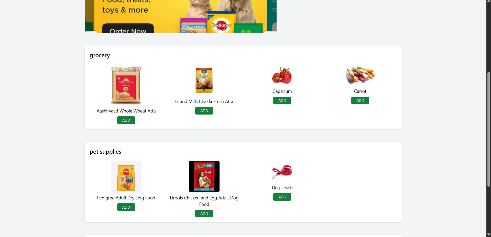
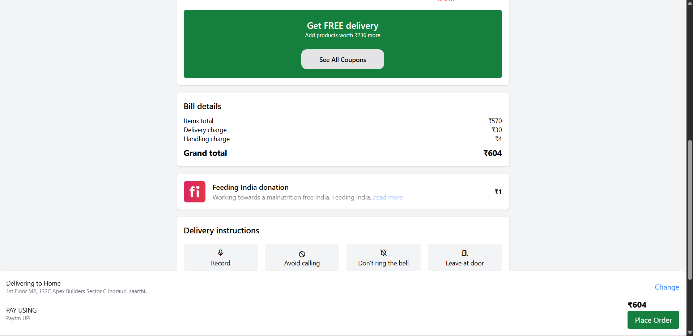
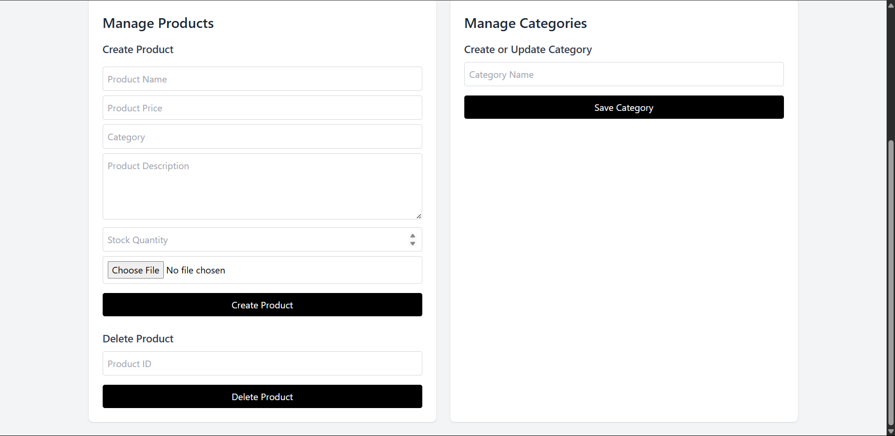
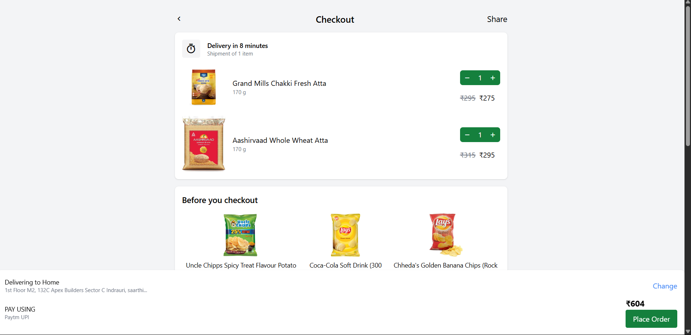

Blinkit Backend Application is a Node.js-based backend server designed to power an online grocery delivery platform similar to Blinkit. It manages core backend functionalities like user authentication, product management, cart and orders, secure payment integration, and real-time session handling.

The project includes secure Google OAuth login, Razorpay payment gateway for handling transactions, and MongoDB for storing user, product, and order data. With robust validation using Joi, image uploads via Multer, and JWT-based session management, the application ensures both performance and security for real-world use cases.

This backend can be easily connected with any frontend (React, HTML+CSS, etc.) to serve as a complete e-commerce solution for grocery or product-based platfor

# Blinkit-Backend-Project

Blinkit Backend Application is a full-featured backend server built using Node.js and Express.js, replicating the core functionalities of an online grocery delivery platform like Blinkit. It handles user authentication, product management, secure payments, session tracking, and more, with a scalable and modular architecture ideal for production environments.

Key features include:

User Authentication using Google OAuth (via Passport.js)

Product & Category Management using Mongoose and MongoDB

Secure Payments via Razorpay Integration

File Upload Support using Multer for product images

Session Handling and JWT-based token management

Form Validation using Joi for input security

"dependencies": {
  "bcrypt": "^5.1.1",
  "cookie-parser": "^1.4.6",
  "dotenv": "^16.4.5",
  "ejs": "^3.1.10",
  "express": "^4.19.2",
  "express-session": "^1.18.0",
  "joi": "^17.13.3",
  "jsonwebtoken": "^9.0.2",
  "mongoose": "^8.5.2",
  "multer": "^1.4.5-lts.1",
  "passport": "^0.7.0",
  "passport-google-oauth20": "^2.0.0",
  "razorpay": "^2.9.4"
}

set up this before running the application
PORT=3000
MONGODB_URI=your_mongo_uri
GOOGLE_CLIENT_ID=your_google_client_id
GOOGLE_CLIENT_SECRET=your_google_client_secret
SESSION_SECRET=your_secret_key
RAZORPAY_KEY_ID=your_key_id
RAZORPAY_KEY_SECRET=your_key_secret
add this key and id  to run application

Steps to run applications   
✅ Step 1: Clone the Repository
bash
Copy
Edit
git clone https://github.com/your-username/blinkit-backend.git
cd blinkit-backend
✅ Step 2: Install Dependencies
bash
Copy
Edit
npm install
This will install all packages from your package.json:

express, mongoose, passport, razorpay, etc.

✅ Step 3: Create a .env File
At the root of the project, create a file named .env and add the following variables:

env
Copy
Edit
PORT=5000
MONGODB_URI=your_mongodb_connection_string
GOOGLE_CLIENT_ID=your_google_oauth_client_id
GOOGLE_CLIENT_SECRET=your_google_oauth_client_secret
SESSION_SECRET=your_session_secret
RAZORPAY_KEY_ID=your_razorpay_key_id
RAZORPAY_KEY_SECRET=your_razorpay_key_secret
🔒 Do not commit this file to GitHub.

✅ Step 4: Start MongoDB Server
Make sure your MongoDB server is running:

If local: run mongod

If cloud (MongoDB Atlas): just make sure your MONGODB_URI is correct

✅ Step 5: Run the Application
bash
Copy
Edit
npm start
By default, it will start on:
👉 http://localhost:5000

✅ Step 6: Test Endpoints
You can now:
Visit /auth/google to login via Google

